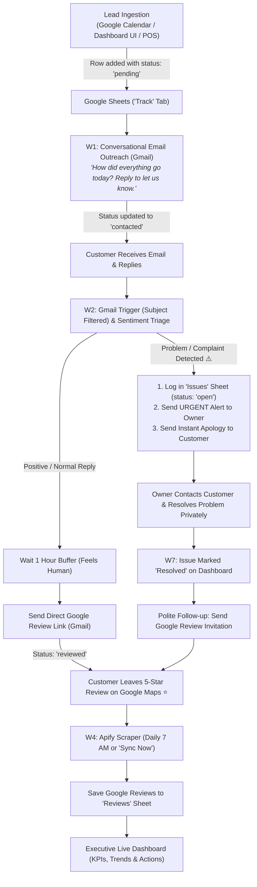

# Review Engine: Complete Architecture & Production Pitch Guide

## 1. Executive Summary & Core Value Proposition
The **Review Engine** is an automated reputation engineering pipeline designed for local service businesses (home services, healthcare, automotive, hospitality, etc.).

### The Core Problem It Solves:
1. **Uncertainty & Review Friction:** Customers rarely go out of their way to leave 5-star reviews unless prompted with a frictionless, personal experience.
2. **Review Bombing & Public Complaints:** Unhappy customers often post destructive 1-star reviews on Google Maps before business management even knows there was an issue.

### The Solution:
Instead of sending generic, impersonal "Rate us 1-5 stars" survey links, the Review Engine uses **Conversational Human Outreach**:
1. Checks in on completed jobs via plain-text conversational email.
2. **Intercepts unhappy customers privately** and alerts the owner immediately.
3. Automatically guides satisfied customers to leave **verified 5-star reviews on Google Maps**.

---

## 2. End-to-End System Architecture

---

## 3. Workflow Specifications (W1 to W8)

| Workflow ID | Workflow Name | Trigger | Action Performed |
| :--- | :--- | :--- | :--- |
| **W1** | **Conversational Outreach** | Schedule (Every 15 min) | Finds `pending` customers in `Track`, sends personal check-in via Gmail, updates status to `contacted`. |
| **W2** | **Reply Triage & Sentiment Escalation** | Gmail Trigger (`subject:"Quick question about your"`) | Parses customer reply. If positive, waits 1h and sends Google review link. If negative, logs to `Issues`, alerts owner via email, and sends customer apology. |
| **W3** | **Gentle Reminder** | Schedule (Daily at 10 AM) | Finds customers who received review link 3+ days ago but haven't clicked or reviewed, and sends a gentle follow-up. |
| **W4** | **Apify Review Scraper** | Schedule (Daily at 7 AM) & Webhook (`/sync-reviews`) | Scrapes Google Maps profile via Apify Actor, extracts review text, star ratings, and timestamps, and appends to `Reviews`. |
| **W5** | **Review Link Click Logger** | Webhook (`/r/:id`) | Increments `review_click_count` in `Track` and redirects customer to Google Maps review shortlink. |
| **W6** | **Live Dashboard API** | Webhook (`GET /data`) | Aggregates all 4 sheet tabs (`Track`, `Issues`, `Reviews`, `Activity`) into a single fast payload for the web dashboard. |
| **W7** | **Post-Resolution Review Invite** | Webhook (`POST /resolve-issue`) | Updates `Issues` status to `resolved` and automatically emails the customer asking for a review after their problem was fixed. |
| **W8** | **Manual Lead Ingestion** | Webhook (`POST /add-customer`) | Inserts new service leads directly from the web dashboard into the `Track` sheet. |

---

## 4. Google Sheets Database Schema

### Tab 1: `Track` (Customer Pipeline)
* `id`: Unique customer tracking ID (e.g. `cust_1725100000`).
* `customer_name`: Name of customer.
* `email`: Customer email address.
* `phone`: Phone number (optional).
* `service`: Service completed (e.g. *HVAC Repair*, *Plumbing*).
* `completion_date`: Date service was completed (`YYYY-MM-DD`).
* `channel`: `email` (or `sms`/`whatsapp`).
* `status`: `pending` ➔ `contacted` ➔ `replied` ➔ `reviewed` (or `issue`).
* `feedback_sent_at`: Timestamp when initial outreach email was sent.
* `feedback_reply_at`: Timestamp when customer replied.
* `reply_text`: Full text of customer's reply.
* `issue_flagged`: `TRUE` / `FALSE`.
* `issue_summary`: Summary of complaint if flagged.
* `review_sent_at`: Timestamp when Google review invitation link was emailed.
* `review_click_count`: Number of times the review link was clicked.
* `created_at` / `updated_at`: Timestamps.

### Tab 2: `Issues` (Complaint Interception & Resolution)
* `id`: Unique issue ticket ID (`issue_123`).
* `customer_name`: Name of customer.
* `customer_email`: Customer email address.
* `summary`: Customer feedback text explaining the problem.
* `severity`: `high`, `medium`, `low`.
* `status`: `open` ➔ `resolved`.
* `created_at`: Timestamp complaint was logged.
* `resolved_at`: Timestamp manager resolved the issue.

### Tab 3: `Reviews` (Public Google Maps Reviews)
* `id`: Unique Google Review ID.
* `track_id`: Matched customer ID (if matched).
* `author`: Reviewer's Google display name.
* `rating`: Star rating (1 to 5).
* `text`: Text body of Google review.
* `url`: Direct link to Google review.
* `captured_at`: Review published date.
* `source`: `apify_sync`.

### Tab 4: `Activity` (Audit Log)
* `id`: Event ID.
* `event`: `email_sent`, `reply_received`, `issue_flagged`, `review_captured`, `gbp_sync`.
* `detail`: Human-readable description.
* `ts`: ISO timestamp.

---

## 5. Executive Dashboard KPIs

| KPI | Formula / Definition | Business Impact |
| :--- | :--- | :--- |
| **🛡️ Reputation Protection Score** | `(Resolved Complaints / Total Flagged Issues) × 100` | Demonstrates how many potential 1-star reviews were prevented from hitting Google. |
| **⭐ Average Rating & Velocity** | `Mean rating of Google Reviews + Monthly Trend` | Direct impact on Google Local 3-Pack SEO and buyer confidence. |
| **📈 Review Conversion Rate** | `(Google Reviews Captured / Outreach Emails Sent) × 100` | Proves ROI of automated reputation system. |
| **💬 Conversational Reply Rate** | `(Replies Received / Total Contacted) × 100` | Shows high engagement velocity due to plain-text human format. |
| **⏱️ Resolution Cycle Time** | `Avg time (hours) from Issue Flagged ➔ Marked Resolved` | Operational metric ensuring rapid customer recovery. |
| **👨‍🔧 Technician / Service Mentions** | `Keyword frequency of employee names in positive reviews` | Rewards top performers and identifies service training gaps. |

---

## 6. How to Add Leads & Completed Services

1. **Directly from Dashboard:**
   * Click the **"Add Customer"** button on the Topbar or Customers page.
   * Enter customer name, email, service completed, and date.
   * Click **Save & Start Outreach** — it automatically appends to the `Track` sheet and triggers W1.
2. **Directly in Google Sheets:**
   * Open the `Track` tab in your spreadsheet.
   * Add a row with `customer_name`, `email`, `service`, and set `status = pending`.
3. **Automated Integration (Google Calendar / CRM):**
   * Whenever a calendar appointment ends or CRM status changes to "Completed", send a POST request to your `/add-customer` webhook.
